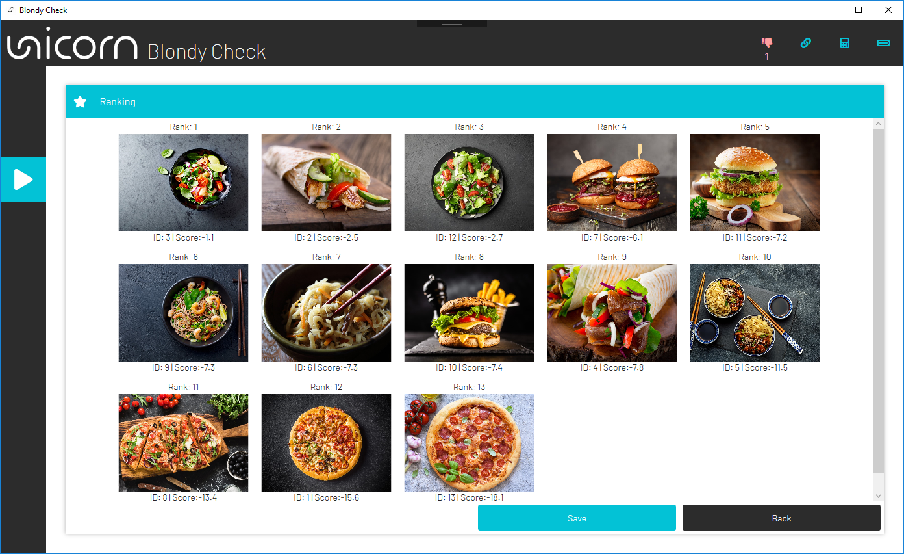

# Unicorn Blondy Check Hybrid Black
[Icons](#icons) <br/>
    - [Control Bar Icons](#control-bar-icons)<br/>
    - [Status Bar Icons](#status-bar-icons)<br/>

[Files on your computer](#files-on-your-computer)<br/>

[First ranking](#first-ranking)<br/>
    - [Calibration settings page](#calibration-settings-page)<br/>
    - [Test settings page](#test-settings-page)<br/>
    - [Test results page](#test-results-page)<br/>
    - [Ranking settings page](#ranking-settings-page)<br/>
    - [Ranking results page](#ranking-results-page)<br/>

[Visual evoked potentials](#visual-evoked-potentials)<br/>
    - [Visual evoked potentials page](#visual-evoked-potentials-page)<br/>

[Creating picture-sets](#creating-picture-sets)<br/>
    - [Picture-set editor](#picture-set-editor)<br/>
    - [Create new picture-set](#create-new-picture-set)<br/>

[Logging the raw data](#logging-the-raw-data)<br/>

Unicorn Blondy check is an application that uses the P300 component of the visual evoked potential to rank images according to interest. The user can create picture-sets and subsequently rank the images according to the EEG signal. The images are presented in a randomized order. Display time, dark time as well as additional parameters are subject to user input but can be set to default values for ease of use.
<p align="center">
<br/>
</p>
The table below lists the terms used in the Blondy Check Software along with a short description:

| Term | Description |
| -------- | ------- |
| Dark time | The amount of time a black screen is displayed between two images. Per default 0 ms. |
| Flash time | The amount of time each image is displayed. Per default 150 ms. |
| Pre-trigger time | The amount of time used for offset-correction prior to the image presentation. Per default 100 ms. |
| Post-trigger time | The amount of time regarded for classification. Determines the frame length, which is the amount of time the EEG signal is recorded after the image is displayed. Per default 1500 ms. |
| Trial | A group of flashes such that each image of the picture-sets is presented once to the test subject. The presentation order is randomized for every trial. |
| Repetitions | The number of trials performed. |
| Calibration picture | Picture sets used to calibrate the system and subsequently test the system must contain a calibration picture. Calibration images should produce a greater P300 than the non-calibration images. |
| Calibration | Before images can be ranked using the EEG signal, the Blondy check system must first be calibrated to the individual brain signals of the test subjects. To do this, the test subject is presented with an image set containing calibration and non-calibration images and the system is calibrated based on the brain response. |
| Test | The Blondy check system can be tested after calibration. For this purpose, a picture-set is presented to the test person. This set must again contain calibration and non-calibration images. After the test is performed, the achieved accuracy can be seen and the system can be recalibrated if necessary. |
| Ranking | After successful calibration, the ranking can be started by showing the test subject picture-sets, after which the system assigns points to each picture according to the brain signal generated. The picture-sets don't need to have calibration pictures assigned for ranking. |

## Icons
### Control Bar Icons
Here is a short overview of the status icons displayed on the left side of the application:
<p align="center">
<br/>
</p>

### Status Bar Icons
<p align="center">
<br/>
</p>
Here is a short overview of the status icons displayed in the upper right corner of the application:
<p align="center">
<br/>
</p>

## Files on your computer
**Unicorn Blondy check files** – are stored under (assuming that the default path setting is used):

```
C:\Users\<username>\Documents\gtec\Unicorn Suite\Hybrid Black\Blondy Check\
```

**Unicorn Blondy check ranking results** - can be stored at any desired location as ".png” file format.
**Unicorn Blondy check** directory - is created under:

```
C:\Users\<username>\Documents\gtec\Unicorn Suite\Hybrid Black\Blondy Check\
```

Formats used in the Blondy check System:

|.pdgm|Contains the created picture-sets.|
| -------- | ------- |
|.csv|Contains the EEG recordings as comma separated values.|
|.png|The ranking results as well as the Visual evoked potentials are saved in this format. |

## First ranking
After the application is started from the “Unicorn Suite” the data viewer is visible and displays the live EEG recording. This is depicted in the picture below:
<p align="center">
<br/>
</p>
The data viewer displays the live EEG recording on the left and the signal quality associated with every Channel on the right (brain-graphic with quality indicators).

After the connection to the Unicorn Hybrid Black system is established (automatically), the quality indicators initially change color from gray to red. After the digital filters have stabilized, the quality indicators should all light up green. If this does not happen, try to improve the signal quality by using electrode gel. If this is not successful, certain channels can be switched off with a simple click, as shown in the picture below. Be careful not to switch channels off and on too often.
<p align="center">
<br/>
</p>
<p align="center">
<br/>
</p>
If the signal indicators for all remaining channels light up green, the next step, the calibration, can be started. Information about the signal quality of the remaining channels can be seen in the thumb icon in the upper right corner of the main window. 
<p align="center">
<br/>
</p>
If the thumb icon is pointing upwards, everything is ok; if it changes color to red, the number under the thumb indicates the number of bad channels.

During the course of the measurement, the display may change to red from time to time. This is caused by blinking or movement artifacts. Only if the thumb shows a bad signal quality for a certain time, you should switch back to the data viewer and try to improve the quality by adding electrode gel or removing the bad channels.

### Calibration settings page
After ensuring adequate signal quality, the Blondy check system must first be calibrated to the individual brain signals of the test subjects. This is necessary before images can be ranked using the EEG signal. To navigate to the calibration page, click the application page Icon: <br/> on the left-hand side.

The calibration page can be seen in the picture below:
<p align="center">
<br/>
</p>
The folder containing the desired picture-sets can be selected by clicking the <br/> icon above the box containing the picture-set thumbnails. Doing so will open a folder selection dialog and the folder containing the picture-sets can be selected. This is shown in the picture below.
<p align="center">
<br/>
</p>
If there is no valid picture-set in the selected folder, the thumbnail box (left box) will be empty. Otherwise, thumbnails of the picture-sets are displayed. Per default settings, the following folder which is installed with the software and contains the prefabricated picture-sets is selected:

```
C:\Users\<username>\Documents\gtec\Unicorn Suite\Hybrid Black\Blondy Check\Picturesets
```
After a folder containing valid picture-sets is selected, you can continue viewing the image sets by moving the mouse over the thumbnails. The name of the image set and the images contained in the set are displayed above and in the right box respectively.
<p align="center">
<br/>
</p>
If the picture-set contains calibration pictures, they are highlighted in blue, as shown in the image above.

Clicking on the image set selects it for the calibration and the highlight in the thumbnails box (left box) changes from gray to blue, shown below.
<p align="center">
<br/>
</p>
If a picture set is selected for the calibration or test that does not contain both calibration and non-calibration images, the following warning is displayed and the calibration/test cannot be started:
<p align="center">
<br/>
</p>

Calibration parameters such as **Dark time**, **Flash time**, **Pre-trigger time** and **Post-trigger time** can only be changed in the calibration setting page. After the calibration is performed, these parameters cannot be changed. The calibration must repeated if a change is desired. The default values are recommended for inexperienced users.
<p align="center">
<br/>
</p>
After selecting a suitable picture-set and adjusting the parameters (or leaving the default values), the calibration can be started by clicking the start calibration button. The images are then presented according to the set parameters. 
<p align="center">
<br/>
</p>

The presentation can be aborted by clicking on the stop icon on the left-hand side. This will cause the presentation to finish after the current trial is completed (i.e. all images presented).  After a completed calibration, the **Test Settings** page is shown and the calibration-completed indicator icon on the top right-hand side changes color from red to blue, shown below:

<p align="center">
<br/>
</p>

### Test settings page
After a completed calibration, the **Test Settings** s page is shown. The only parameter that can be changed now is the **Nr. of test repetitions** that can be set for the test. 10 repetitions are set by default, but this number can be increased or decreased for more complex tasks where 10 repetitions might not be enough. Similar to the calibration procedure, the selected picture-set needs to contain both target and nontarget images. If testing the previously calibrated system is not desired/required, you can skip it and continue with the ranking directly by clicking on the **Skip test** button.
<p align="center">
<br/>
</p>

Click the **Start test** button to display the test picture-set and the performance of the calibrated system.

### Test results page
After the test is completed, the achieved accuracy is displayed according to the number of trials (this number is set in the **Nr. of test repetitions** box in the test settings page), shown in the picture below:
<p align="center">
<br/>
</p>

If 100 % accuracy is not achieved, you should repeat the calibration or the test (**Repeat calibration** button/ **Repeat test** button). If the test result is satisfactory, the ranking can be set up in the **Ranking Settings** page by clicking on the **Ranking** button.

### Ranking settings page
Any picture-set can be used for ranking; it does not have to contain calibration and non-calibration images like for calibration and testing. This is because the images are assigned points according to the brain signal and are thus ranked. Similar to the testing, the only parameter that can be changed is the **Nr. of ranking repetitions**. As mentioned earlier, the other parameters are set during the calibration phase and you must recalibrate of the system to make any changes.
<p align="center">
<br/>
</p>

After the picture-set has been selected to be ranked, the procedure can be started with a click on **Start ranking** button.

### Ranking results page
After the ranking procedure is completed, the images are assigned a score according to the EEG signal. The images in order of highest score are then displayed on the ranking results page and can be saved in any location by clicking the **Save** button. Click the **Back** button to display the ranking settings page, and the ranking can be simply repeated or a new picture-set can be loaded and ranked.
<p align="center">
<br/>
</p>
<p align="center">
<br/>
</p>
Two example results are shown above. In the first example, the user was mostly interested in the images of women. The second example suggests that the user isn’t a big fan of pizza.<br><br>

**Attention**: The results are discarded after clicking on the **Back** button. So, do not forget to save the results by clicking on the **Save** button, if desired.

## Visual evoked potentials
Visually evoked potentials (VEP, also: VECP = visually evoked cortical potentials) are small electrical potentials differences caused by visual stimulation and are measured during the Blondy check. Shape amplitude and latency of VEPs have been shown to correlate with the cognitive processes involved in processing the images. This makes the VEPs an advantageous tool to further investigate the cognitive effects of the displayed images supplementary to just the ranking results. 

After each Blondy check is performed, the VEPs for the corresponding electrode are averaged and are available in the **Visual Evoked Potentials** page. To get to the **Visual Evoked Potentials** page, click the corresponding **Visual Evoked Potentials** button on the **Test/Ranking Settings** page. The **Visual Evoked Potentials** button can be seen in the picture below in the upper right corner underneath the status icons.
<p align="center">
<br/>
</p>

**Attention**: After each performed Blondy Check, the **Visual Evoked Potentials** are overwritten with the new **Visual Evoked Potentials** corresponding to the last performed Blondy check. So, if you want to save the results, remember to click the **Save selection/Save all** button.

### Visual evoked potentials page
After performing the Blondy check at least once and pressing the **Visual Evoked Potentials** button, you will be taken to the **Visual Evoked Potentials** page shown below.
<p align="center">
<br/>
</p>
The pictures on the left side of the page correspond to the pictures used in the last performed Blondy check. Click on one of the images to select it and highlight it in blue. The VEPs of each electrode are then displayed on the right side. This is illustrated in the image below.
<p align="center">
<br/>
</p>
Additionally, you can display the corrected VEPs. Corrected in the context of VEP simply means that the average value of all other VEPs from the picture-set is subtracted from the selected potential. 
<p align="center">
<br/>
</p>

The corrected VEPs are displayed by switching the toggle button in the lower left corner of the **Visual Evoked Potentials** page from **Raw** to **Corrected** as shown above. The corrected VEPs are depicted in red while the raw VEPs are depicted in blue.
<p align="center">
<br/>
</p>

There are two options to save the VEP data: **Save selection** and **Save all**. Both create a folder in the following path:
```
C:\Users\<username>\Documents\gtec\Unicorn Suite\Hybrid Black\Blondy Check
```

Clicking the **Save selection** button creates a folder with the name:

```VEP_<Picture-set name>_Selection_<Year>_<Month>_<Day>_<hh>_<mm>_<ss>```
<p align="center">
<br/>
</p>
The folder contains following:

* 1 x ```VEP_<Picture-set name>_ImageID_<ID>.csv``` file containing the VEPs as comma separated values. 
* 1-8 x ```VEP_plot_<Channel number>_ImageID_<ID>.png``` files containing the plotted VEP data.
<p align="center">
<br/>
</p>

Clicking the **Save all** button creates a folder with the name:

```VEP_<Picture-set name>_<Year>_<Month>_<Day>_<hh>_<mm>_<ss>```
<p align="center">
<br/>
</p>

This folder contains a subfolder for each picture in the picture-set with following name:

```VEP_<Picture-set name>_ImageID_<ID>_<Year>_<Month>_<Day>_<hh>_<mm>_<ss>```
<p align="center">
<br/>
</p>

Each folder contains following:
* 1 x ```VEP_<Picture-set name>_ImageID_<ID>.csv``` file containing the VEPs as comma separated values. 
* 1-8 x ```VEP_plot_<Channel number>_ImageID_<ID>.png``` files containing the plotted VEP data.
<p align="center">
<br/>
</p>

**Attention**: If the data is set in **Corrected** form, this is also the data that is saved. If you want to save the **Raw** data, you have to switch back to **Raw** before saving. You should save the **Raw** data so it can still be processed afterwards.

## Creating picture-sets
To edit or create picture-set for your experiments, simply click on the **Picture-set Editor** Icon  on the left side of the main window. This causes the **Picture-set Editor** page to open.

### Picture-set editor
Here new picture-sets can be created, edited and saved additionally existing picture-sets can be loaded, edited and saved. The **Picture-set Editor** page is shown below:
<p align="center">
<br/>
</p>

### Create new picture-set
Creating a new picture set using the picture-set editor is as simple as dragging the desired images into the editor field and then clicking on the **Save** button.

You can import the desired images by simply dragging and dropping into the editor field or copying the desired image and then pasting it with the “Command+V” short-cut in the editor field. An example of a new picture-set is shown below:
<p align="center">
<br/>
</p>
To delete a picture from the picture-set, simply click on the picture once. This selects the image and highlights it in light blue. This way, multiple pictures can be selected at once. This is shown in the picture below:
<p align="center">
<br/>
</p>
To remove the picture selection, press the “Delete” key on the keyboard. The result of this deletion is depicted in the image below:
<p align="center">
<br/>
</p>
To create a calibration/test picture-set, simply double click on the desired image. The picture set now contains a calibration image. This way, multiple calibration images can be set in the picture-set.
<p align="center">
<br/>
</p>

After the picture-set is completed, it can be saved by clicking on the **Save** button. This will open a save dialogue in which the picture-set can be named as desired. The picture-set is saved as a ```.pdgm``` file, which is the only recognized file format.

To use your newly created picture-set, simply select the folder where the picture-set is stored in the **Calibration**, **Test** or **Ranking Settings** page respectively.

**Attention**: The resolution of the images should not be too high (recommended max. resolution: 1024x764). Picture-sets with higher resolution might slow down the System.

## Logging the raw data
The Blondy check software can also record and save the raw data from the session. This can be especially useful for those who want to further analyze the data offline.
<p align="center">
<br/>
</p>

To initiate data logging, you can set the toggle box in the **Calibration Settings** page under the point Raw-data logging from **OFF** to **ON**.
<p align="center">
<br/>
</p>

After data logging has been switched on, a ```.csv``` file is created under the following path:
```
C:\Users\<username>\Documents\gtec\Unicorn Suite\Hybrid Black\Blondy Check
```
The file is named ```EEG_Raw_Data_<Year>_<Month>_<Day>_<hh>_<mm>_<ss>.csv``` and contains 12 columns with each row corresponding to one time point.
* Columns 1-8.... Is the EEG data from channels 1-8 in [µV]
* Column 9......Is 1 if this sample corresponds to a stimulus presentation 
* Column 10 ...is the picture ID
* Column 11....is 1 if this sample corresponds to a calibration picture 
* Column 12... is 1 if this sample corresponds to a non-calibration picture
* Column 13....is the current trial count.
* Column 14....is 1 if the current sample corresponds to the last stimulus of the current trial.
<p align="center">
<br/>
</p>